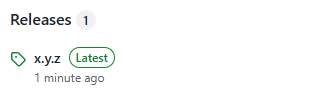
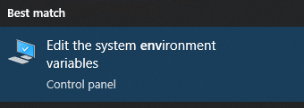

# Touch for Windows


This is a Rust implementation for Windows of the `touch` command found on UNIX-like operating systems.

> [!IMPORTANT]
> This is code written by a beginner in Rust for learning purposes.
> I'm sure the experienced Rustaceans here know better ways to write it.
> If that's the case, I would be grateful if you could kindly offer advice through the Issues section.

## Usage

```
$ touch <file…>
```

If the file specified in the argument does not exist, it will be created.
If the file already exists, its timestamp will be updated.

You can also list multiple files in the argument.

### -c

If you specify the option `c`, the file will not be created if it does noe exist.
If it already exists, the timestamp will be updated as usual.

### -d <%Y-%m-%d %H:%M:%S>

Specifies the timestamp.

### -r \<file\>

Set the timestamp to the same time as another file.

> [!TIP]
> The d and r options cannot be specified at the same time.

## Installation

### 1. Download `touch.exe` from "Releases".



It is recommended that you use the most recent release,
excluding pre-releases.

### 2. Place it in any directory.

```shell
PS C:\> cd '.\Program Files\'
PS C:\Program Files> mkdir touch-for-windows


    Directory: C:\Program Files


Mode                 LastWriteTime         Length Name
----                 -------------         ------ ----
d-----         12/4/2024  12:35 PM                touch-for-windows


PS C:\Program Files> mv ~\Downloads\touch.exe .
```

You must run with administrator to place it in `C:\Program Files`,
and although the examples use `C:\Program Files`, it is not necessary to place it there.

### 3. Use "Edit the system environment variables" in the Control Panelto add the directory you placed there to your path.


